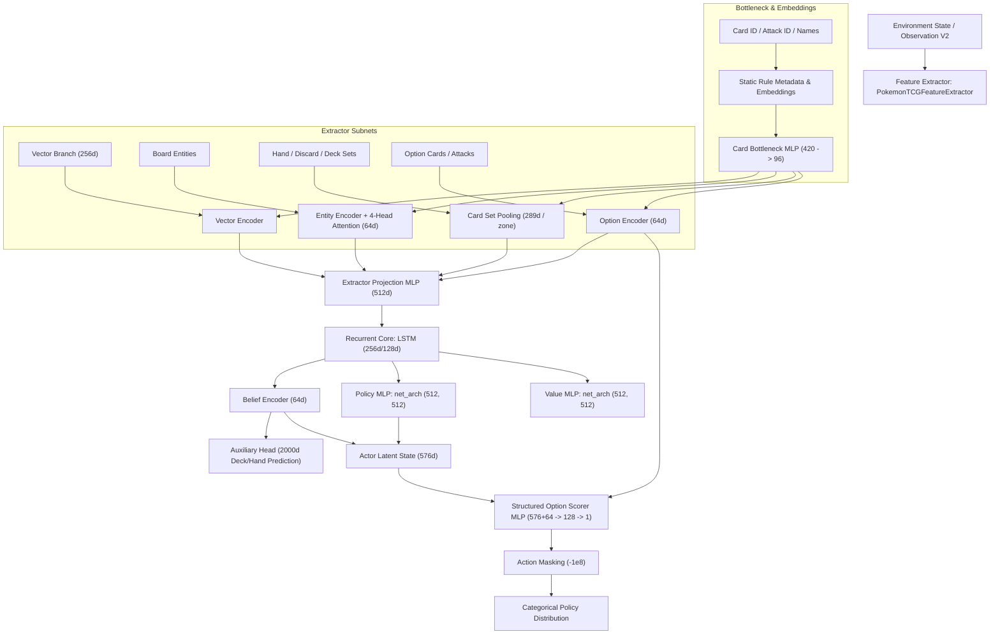

# System Architecture & Data Flow Documentation (EXP16 Default)

This document details the complete end-to-end data pipeline, feature extraction, neural architecture, and option/action encoding for the **EXP16 (PPO v6)** model setup.

---

## 1. High-Level Data-Flow Overview



---

## 2. Input Representation (Observation V2)

The environment produces a `Dict` observation space (`Observation V2`) containing structured tensors:

| Component | Shape / Type | Description |
| :--- | :--- | :--- |
| `vector` | `[Float]` (~800+ dim) | Dense numerical game state (prizes left, turn number, energy attached, etc.). Redundant raw card/attack IDs are masked out via `vector_keep_mask`. |
| `entity_ids` | `[Int]` (`ENTITY_SLOTS`) | Card IDs for Active & Bench Pokémon on field (both sides). |
| `entity_features` | `[Float]` (`ENTITY_SLOTS, ENTITY_FEATURE_DIM`) | Dynamic entity state (HP, status conditions, damage counters, retreat status). |
| `entity_tool_ids` | `[Int]` (`ENTITY_SLOTS`) | Card IDs of attached Pokémon Tools. |
| `entity_pre_evolution_ids` | `[Int]` (`ENTITY_SLOTS, MaxEvolutions`) | Card IDs of pre-evolutions under active/bench Pokémon. |
| `entity_energy_card_ids` | `[Int]` (`ENTITY_SLOTS, MaxEnergy`) | Card IDs of attached Energy cards. |
| **Zone Card Sets** | `[Int]` (`hand_ids`, `discard_ids`, `prize_ids`, `search_ids`, `looking_ids`, `own_deck_ids`, `log_card_ids`, `context_card_ids`) | Categorical Card IDs present in each specific zone. |
| **Option Fields** | `[Int/Float]` (`option_card_ids`, `option_attack_ids`, `option_types`, `option_areas`, `option_features`, `action_mask`) | Categorical and numerical metadata describing each candidate action/option. |

---

## 3. Card & Rule Metadata Embedding ("Card Bottleneck")

Rather than treating card IDs as arbitrary tokens, cards and attacks are mapped to dense rule-informed representations:

1. **Rule Text Extraction (`_effect_metadata`)**:
   - Parses English card/attack rules text into a 96-dimensional coarse feature vector (e.g., `draw`, `search_deck`, `damage_multiplier`, `heal_amount`, typed energy costs).
2. **Metadata Matrices**:
   - **Card Metadata** (`CARD_METADATA_DIM = 150`): Static card statistics (card type, HP, retreat cost, energy type, weaknesses, stage, rule box flags) + 96 effect metadata.
   - **Attack Metadata** (`ATTACK_METADATA_DIM = 110`): Printed damage, total energy cost, typed energy requirements + 96 effect metadata.
3. **Card Bottleneck Projection (`_raw_card_repr`)**:
   - Concatenates:
     - Card Embedding (`CARD_EMBED_DIM = 24`)
     - Card Metadata (150)
     - Mean Attack Embedding & Metadata ($16 + 110 = 126$)
     - Mean Skill Metadata (96)
     - Evolution Name Tokens Embedding ($12 + 12 = 24$)
   - Total Raw Dimension: **420**.
   - **Linear Projection**: `Linear(420, 96) + ReLU()` $\rightarrow$ **`card_repr_dim = 96`**.
   - *(Note: In inference/evaluation mode, `use_card_table=True` caches this 96-dim table across all valid card IDs into `_frozen_card_table` to maximize speed)*.

---

## 4. Encoder Architecture (`PokemonTCGFeatureExtractor`)

The encoder processes distinct sub-components through dedicated pathways before fusing them into a unified feature representation (`features_dim = 512`):

```
+-----------------------------------------------------------------------------------+
|                            PokemonTCGFeatureExtractor                             |
+-------------------+--------------------+--------------------+---------------------+
| Vector Branch     | Entity Branch      | Card Set Pooling   | Option Pooling      |
| LayerNorm(V_dim)  | Entity Card Repr   | Per Zone Pooling   | Shared Option Enc   |
| -> Linear(384)    | + Tools + Energy   | (Hand, Discard,    | (Card + Attack +    |
| -> Linear(256)    | -> Linear(128->64) | Deck, Prizes)      | Type + Area + Feat) |
|                   | MultiHeadAttn(4h)  | Mean, Max, Sum,    | -> Linear(128->64)  |
|                   | Residual Connect   | Log-Count          | Mean & Max Pool     |
+-------------------+--------------------+--------------------+---------------------+
                                      |
                           Concat All Feature Vectors
                                      |
                      Linear(combined_dim, 512) + ReLU
                      Linear(512, 512) + ReLU
                                      |
                             features_dim = 512
```

1. **Vector Encoder Branch**:
   - `LayerNorm(vector_dim)` $\rightarrow$ `Linear(vector_dim, 384) + ReLU` $\rightarrow$ `Linear(384, 256) + ReLU` $\rightarrow$ **256d**.
2. **Entity Encoder & Multi-Head Attention**:
   - Inputs per entity slot: Card Representation (96) + Tool Repr (96) + Pre-evolution Repr (96) + Energy Repr (96) + `entity_features`.
   - `entity_encoder`: `Linear(entity_input_dim, 128) + ReLU` $\rightarrow$ `Linear(128, 64) + ReLU`.
   - **Attention**: `MultiheadAttention(embed_dim=64, num_heads=4, batch_first=True)` over entity slots.
   - Residual output: `(entity_embeds + attn_out).flatten()` $\rightarrow$ **`ENTITY_SLOTS * 64`d**.
3. **Card Set Pooling (`_pool_card_set`)**:
   - Applied to Hand, Discard (Own & Opponent), Prizes (Own & Opponent), Search, Looking, Own Deck, Log, Context.
   - For each zone, aggregates card embeddings via:
     - **Mean**: Masked mean representation ($96d$)
     - **Max**: Channel-wise maximum ($96d$)
     - **Sum**: Scaled sum ($96d$)
     - **Count**: Log-normalized card count ($\log(1 + n) / \log(121)$) ($1d$)
   - Dimension per pooled set: **289d**.
4. **Option Pool Concatenation**:
   - Encodes all active options via `encode_options` ($64d$ per option).
   - Computes `option_mean` ($64d$) and `option_max` ($64d$) over active options.
5. **Fused Feature Projection (`self.net`)**:
   - All sub-vector outputs concatenated $\rightarrow$ `combined_dim`.
   - `Linear(combined_dim, 512) + ReLU` $\rightarrow$ `Linear(512, 512) + ReLU` $\rightarrow$ **`features_dim = 512`**.

---

## 5. Recurrent Core & MLP Architecture (EXP16 Configuration)

```
   features_dim (512)
           │
           ▼
    LSTM (Hidden: 256)
           │
     ┌─────┴────────────────────────┐
     ▼                              ▼
Policy MLP                      Value MLP
Linear(256, 512) + ReLU         Linear(256, 512) + ReLU
Linear(512, 512) + ReLU         Linear(512, 512) + ReLU
     │                              │
     │                              ▼
     │                         Value Head
     │                        Linear(512, 1)
     ▼
Belief Concatenation
  + Belief Embedding (64d)
     │
     ▼
Actor Latent State (576d)
```

1. **Recurrent Memory**:
   - `RecurrentPPO` / `PokemonTCGRecurrentPolicy` feeds extracted `features_dim` (512) through an `LSTM` (`hidden_size` = 256).
2. **Policy & Value MLP Heads (`net_arch: [512, 512]`)**:
   - Configured via `net_arch: [512, 512]` in `exp_016_pfsp_selfplay_league_stage1.yaml`.
   - **Policy Branch (`forward_actor`)**: `Linear(256, 512) + LayerNorm_ReLU` $\rightarrow$ `Linear(512, 512) + LayerNorm_ReLU` $\rightarrow$ Policy Latent ($512d$).
   - **Value Branch (`forward_critic`)**: `Linear(256, 512) + LayerNorm_ReLU` $\rightarrow$ `Linear(512, 512) + LayerNorm_ReLU` $\rightarrow$ `Linear(512, 1)`.
3. **Belief & Auxiliary Head**:
   - `belief_encoder`: `Linear(lstm_hidden, belief_dim=64) + ReLU()`.
   - `aux_head`: `Linear(belief_dim=64, 256) + ReLU()` $\rightarrow$ `Linear(256, 2000)` (predicts unobserved hand & prize card distributions).
   - **Actor Latent Fusion**: `actor_latent = torch.cat([latent_pi, belief_embedding.detach()], dim=-1)` $\rightarrow$ **576d**.

---

## 6. Options Encoding & Action Selection

Options/Legal Actions are dynamically encoded and scored rather than mapped to fixed action indices:

```
                                  Actor Latent State (576d)
                                              │
                                              ▼
Option Card ID ──► Card Repr (96d) ─┐
Option Attack ID ─► Attack Emb (16d)│
Option Type ─────► Type Emb (8d)    ├──► Option Encoder ──► Option Embedding (64d)
Option Area ─────► Area Emb (6d)    │   Linear(244, 128)        │
Option Features ─► Features (8d) ───┘   Linear(128, 64)         │
                                                                ▼
                                                    Option Scorer MLP
                                                    Linear(576+64, 128) + ReLU
                                                    Linear(128, 1)
                                                                │
                                                                ▼
                                                       Option Logit
                                                                │
                                                       Action Masking
                                                       + (1 - mask) * -1e8
                                                                │
                                                                ▼
                                                    Categorical Distribution
```

1. **Option Input Encoding (`encode_options`)**:
   - Each legal option in `MAX_ENCODED_OPTIONS` (up to 128) is represented by:
     - Card Representation ($96d$)
     - Attack Embedding ($16d$) + Attack Metadata ($110d$)
     - Option Type Embedding ($8d$) (18 classes: play card, attach energy, attack, retreat, etc.)
     - Option Area Embedding ($6d$) (14 classes: hand, active, bench, discard, etc.)
     - Option Features ($8d$)
   - Processed through `option_encoder`: `Linear(244, 128) + ReLU` $\rightarrow$ `Linear(128, 64) + ReLU` $\rightarrow$ **`option_embedding` (64d)**.
2. **Option Scoring (`option_scorer`)**:
   - Combines the global **Actor Latent State** ($576d$) with each candidate **Option Embedding** ($64d$).
   - Scores each option: `Sequential(Linear(576 + 64, 128), ReLU(), Linear(128, 1))`.
3. **Action Masking & Output**:
   - `logits = logits + (1.0 - action_mask) * -1e8`
   - Invalid options are forced to $-\infty$, ensuring strict zero probability during softmax sampling.
