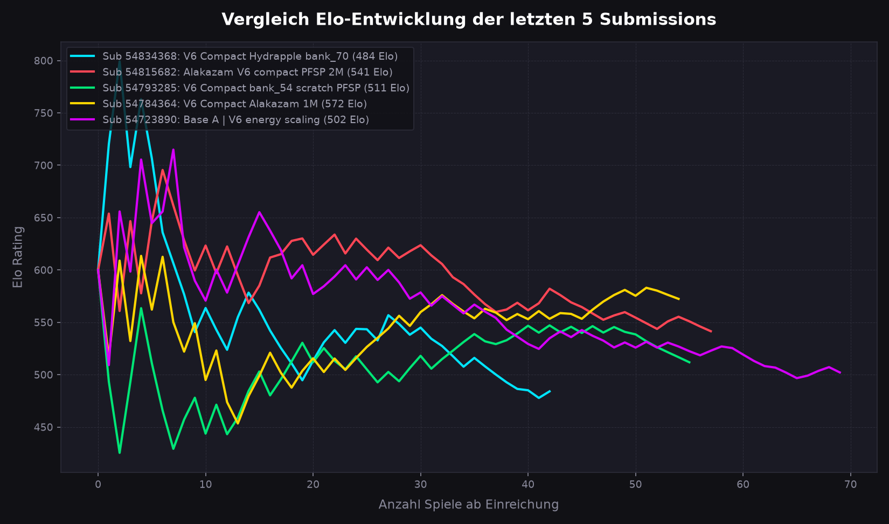
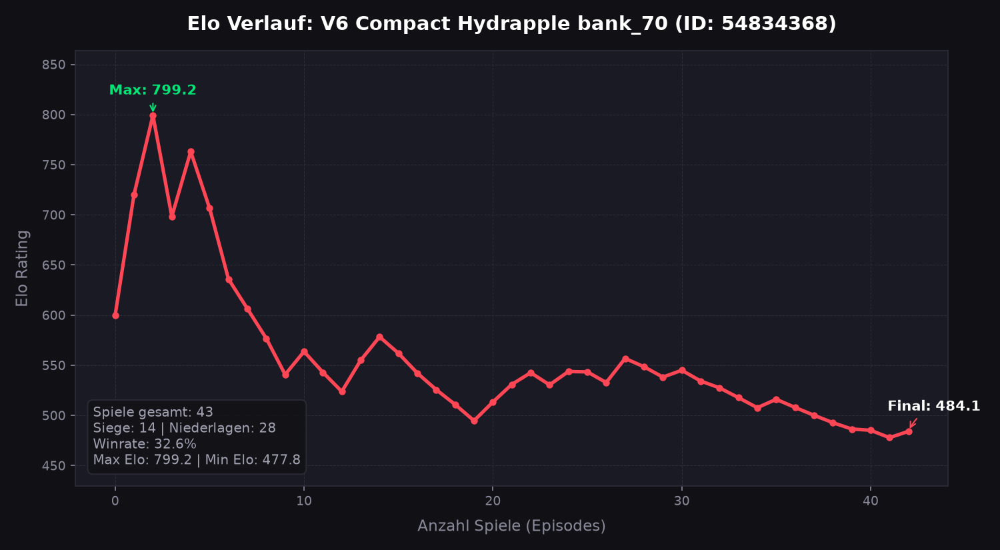
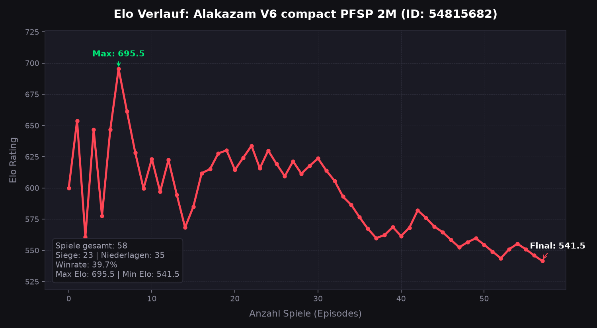
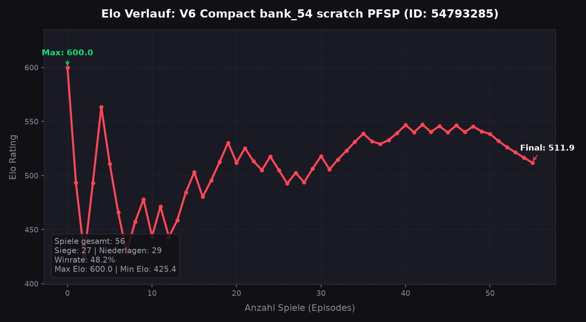
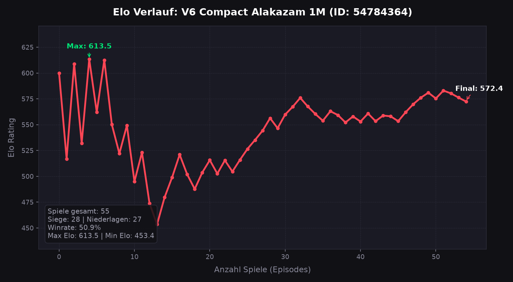
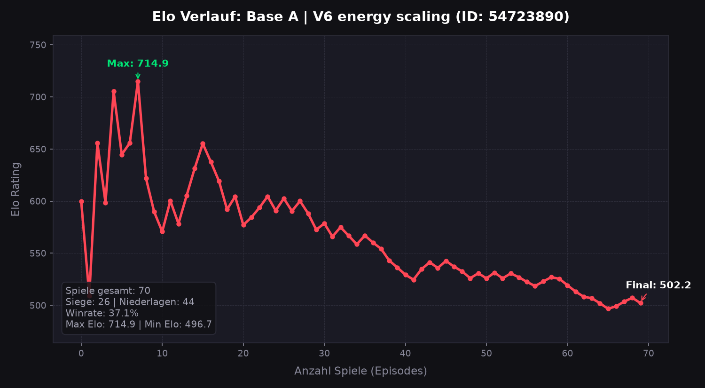

# Kaggle Elo History Report

Generated at: 2026-07-20 11:33:30

Detaillierter Verlauf der letzten 5 completed Submissions auf Kaggle.

## 1. Gesamtvergleich

## 2. Einzelstatistiken & Details

### Submission 54834368 - V6 Compact Hydrapple bank_70

- **Final Elo**: 484.1
- **Peak Elo**: 799.2
- **Spiele gesamt**: 43 (Siege: 14 | Niederlagen: 28)
- **Winrate**: 32.6%

---

### Submission 54815682 - Alakazam V6 compact PFSP 2M

- **Final Elo**: 541.5
- **Peak Elo**: 695.5
- **Spiele gesamt**: 58 (Siege: 23 | Niederlagen: 35)
- **Winrate**: 39.7%

---

### Submission 54793285 - V6 Compact bank_54 scratch PFSP

- **Final Elo**: 511.9
- **Peak Elo**: 600.0
- **Spiele gesamt**: 56 (Siege: 27 | Niederlagen: 29)
- **Winrate**: 48.2%

---

### Submission 54784364 - V6 Compact Alakazam 1M

- **Final Elo**: 572.4
- **Peak Elo**: 613.5
- **Spiele gesamt**: 55 (Siege: 28 | Niederlagen: 27)
- **Winrate**: 50.9%

---

### Submission 54723890 - Base A | V6 energy scaling

- **Final Elo**: 502.2
- **Peak Elo**: 714.9
- **Spiele gesamt**: 70 (Siege: 26 | Niederlagen: 44)
- **Winrate**: 37.1%

---

