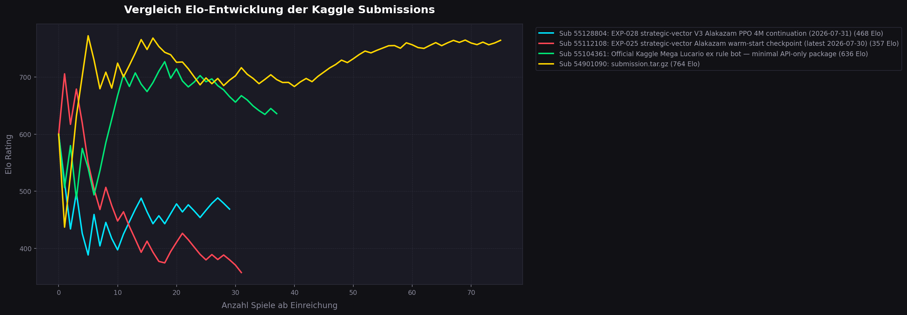
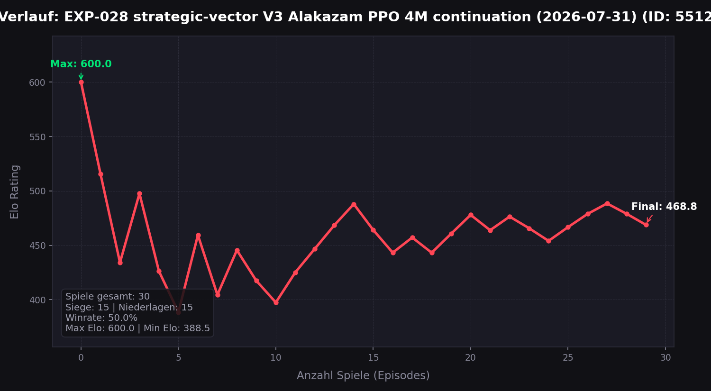
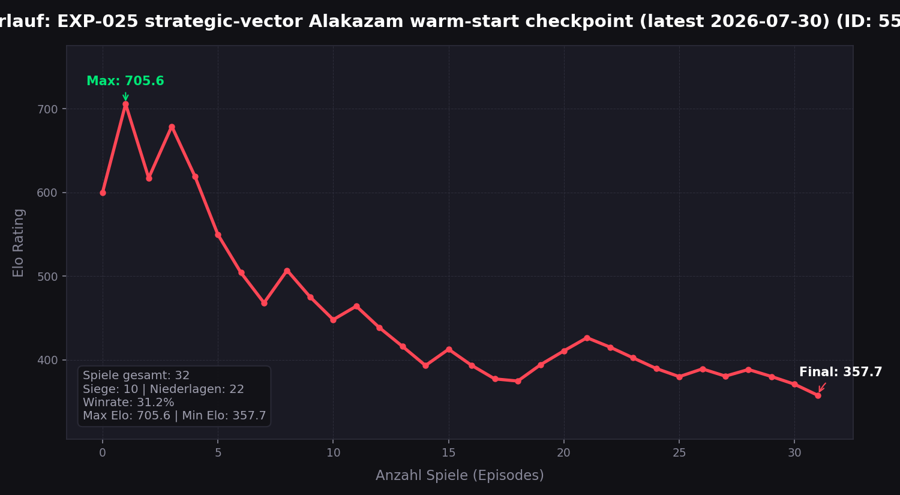
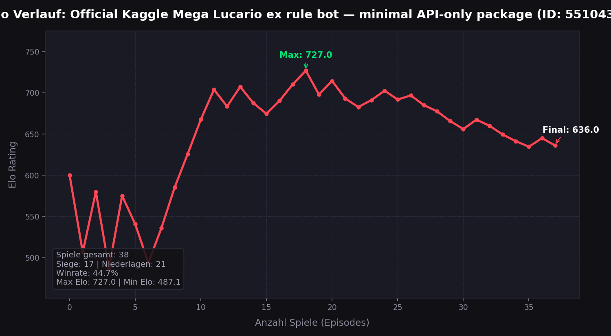
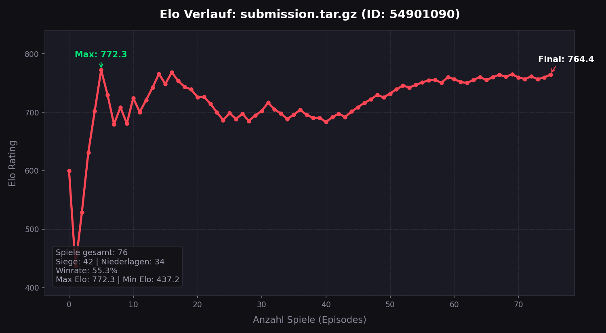

# Kaggle Elo History Report

Generated at: 2026-07-31 12:39:31

Detaillierter Verlauf der letzten 5 completed Submissions auf Kaggle.

## 1. Gesamtvergleich

## 2. Einzelstatistiken & Details

### Submission 55128804 - EXP-028 strategic-vector V3 Alakazam PPO 4M continuation (2026-07-31)

- **Final Elo**: 468.8
- **Peak Elo**: 600.0
- **Spiele gesamt**: 30 (Siege: 15 | Niederlagen: 15)
- **Winrate**: 50.0%

---

### Submission 55112108 - EXP-025 strategic-vector Alakazam warm-start checkpoint (latest 2026-07-30)

- **Final Elo**: 357.7
- **Peak Elo**: 705.6
- **Spiele gesamt**: 32 (Siege: 10 | Niederlagen: 22)
- **Winrate**: 31.2%

---

### Submission 55104361 - Official Kaggle Mega Lucario ex rule bot — minimal API-only package

- **Final Elo**: 636.0
- **Peak Elo**: 727.0
- **Spiele gesamt**: 38 (Siege: 17 | Niederlagen: 21)
- **Winrate**: 44.7%

---

### Submission 54901090 - submission.tar.gz

- **Final Elo**: 764.4
- **Peak Elo**: 772.3
- **Spiele gesamt**: 76 (Siege: 42 | Niederlagen: 34)
- **Winrate**: 55.3%

---

